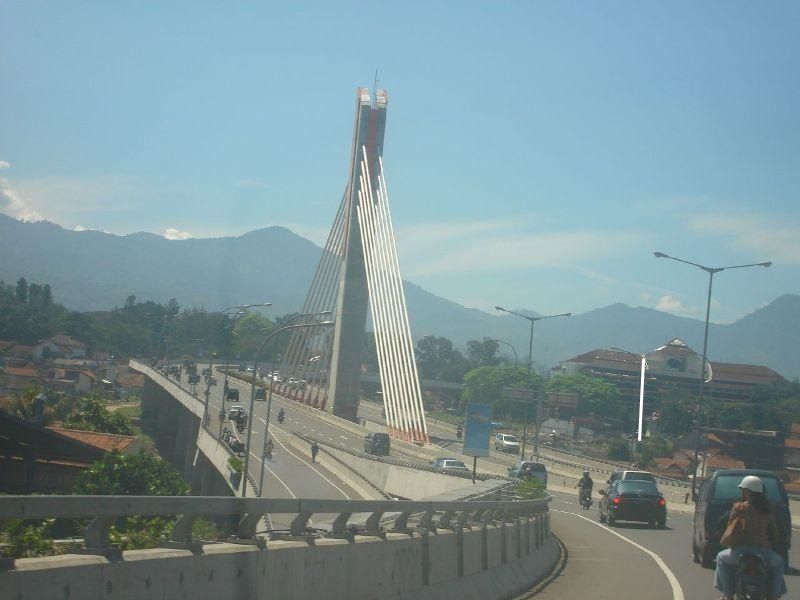

# LAPORAN HASIL INVESTIGASI DIGITAL FORENSIK
**Nomor Laporan:** LHI-DF/2026/01/001
**Klasifikasi:** Rahasia / Confidential
**Instansi:** Laboratorium Forensik Digital
**Investigator:** Adrian

---

## 1. FORM BUKTI DIGITAL (EVIDENCE CHAIN OF CUSTODY)
Rantai penjagaan bukti digital ini mendokumentasikan setiap personel yang menangani bukti, waktu penanganan, dan tujuan penanganan untuk menjamin integritas bukti di pengadilan.

| No | Tanggal / Waktu | Aktivitas Penanganan | Personel | Lokasi |
| :--- | :--- | :--- | :--- | :--- |
| 1 | 15/01/2026 21:00 | Penerimaan barang bukti digital berupa file gambar suspect. | Adrian | Lab Forensik |
| 2 | 15/01/2026 21:10 | Pembuatan salinan kerja (Working Copy) dan verifikasi hash asli. | Adrian | Workstation 01 |
| 3 | 15/01/2026 21:30 | Analisis struktural dan ekstraksi metadata EXIF. | Adrian | Workstation 01 |
| 4 | 15/01/2026 22:00 | Analisis statistik LSB dan pengujian Chi-Square Attack. | Adrian | Workstation 01 |
| 5 | 15/01/2026 22:30 | Analisis perbandingan visual bit-plane (Suspect vs Clean). | Adrian | Workstation 01 |
| 6 | 15/01/2026 23:00 | Finalisasi temuan dan penyusunan laporan investigasi. | Adrian | Workstation 01 |

---

## 2. TABEL HASIL INTEGRITY BUKTI (SHA-256)
Integritas bukti diverifikasi menggunakan algoritma hashing SHA-256 yang memiliki tingkat resistensi tabrakan (collision resistance) yang sangat tinggi.

| No | Nama Barang Bukti | Nilai Hash SHA-256 | Status Integritas |
| :--- | :--- | :--- | :--- |
| 1 | `Picture_UAS_Steganografi.jpg` | `70C9EB75B012A7D59478F46A93F4CD998C38CABD15614AB03BA9807109DD11BD` | Terverifikasi |
| 2 | `Picture_UAS_Steganografi_fixnodata.jpg` | `E65030B44CE17D49EDDD80E3EAD94536C202E69C4143B30BEBBBB61E1A1B80BB` | Terverifikasi |
| 3 | `super_clean_baseline.jpg` | `01602E220CA9266B9286DA666A0BEB6080664A666E55BD6997697463FF763FB3` | Terverifikasi |
| 4 | `Picture_UAS_Steganografi_steghide.jpg` | `7A98E479B42388DB223DF8EBBB523FBF60A6DBA156547FFE023A06052D5AAC58` | Terverifikasi |
| 5 | `Picture_UAS_Steganografi_hidden.jpg` | `C8A5EEE2B0231752E28905275EA80D2F7FE0079E87E5F01320DBBD6315FD619B` | Terverifikasi |

### 2.1 Lampiran Barang Bukti (Evidence Gallery)
Berikut adalah representasi visual dari barang bukti utama yang dianalisis dalam investigasi ini.

**Barang Bukti 1: Suspect Image**

*Nama: Picture_UAS_Steganografi.jpg | SHA-256: 70C9EB75B012A7D59478F46A93F4CD998C38CABD15614AB03BA9807109DD11BD*

**Barang Bukti 2: Clean Reference**

*Nama: Picture_UAS_Steganografi_fixnodata.jpg | SHA-256: E65030B44CE17D49EDDD80E3EAD94536C202E69C4143B30BEBBBB61E1A1B80BB*

**Barang Bukti 3: Stego Simulation (Adrian)**

*Nama: adrian_stego.jpg | SHA-256: 3901184BC6126F9459D7C6F389A1967E1CF5428587B8B7BA2682341B579E6DE6*

---

## 3. TAHAPAN INVESTIGASI (DIGITAL FORENSIC PROCESS)

### 3.1 Tahap Identifikasi & Koleksi
Investigator mengidentifikasi file `Picture_UAS_Steganografi.jpg` sebagai objek utama. Dilakukan akuisisi data dan pembuatan salinan bit-stream untuk mencegah kerusakan pada bukti asli.

### 3.2 Tahap Pemeriksaan Struktural (EOI Marker)
Dilakukan pemeriksaan terhadap struktur internal file JPEG, khususnya pada bagian header dan footer (EOI Marker).
- **Metode:** Pencarian hex pattern `FF D9`.

| File Label | Jumlah EOI Marker | Posisi Terakhir | Status |
| :--- | :---: | :--- | :--- |
| **Suspect** | 1 | 90451 | Normal |
| **Clean Reference** | 1 | 90415 | Normal |
| **Steghide (Sim)** | 1 | 90310 | Normal |
| **OpenStego (Sim)** | 2 | 90451, 1440052 | **Anomali** |

### 3.3 Tahap Analisis Steganalisis LSB
Menganalisis bit paling tidak signifikan (Least Significant Bit) pada data pixel.
- **Metode:** Ekstraksi bit-plane ke-0 dan perhitungan rata-rata statistik.

| File Label | Red LSB Avg | Green LSB Avg | Blue LSB Avg | Kesimpulan |
| :--- | :--- | :--- | :--- | :--- |
| **Suspect** | 0.494881 | 0.495346 | 0.498152 | Identik |
| **Clean Reference** | 0.494881 | 0.495346 | 0.498152 | Baseline |
| **Steghide (Sim)** | 0.494935 | 0.495527 | 0.497973 | Deviasi |

### 3.4 Tahap Analisis Chi-Square Attack
Menguji tingkat keacakan (entropy) dari bit LSB untuk mendeteksi keberadaan data terenkripsi.

| File Label | P-Value | Interpretasi |
| :--- | :--- | :--- |
| **Suspect** | 0.379700 | Pola Alami (Bersih) |
| **Clean Reference** | 0.379700 | Pola Alami (Bersih) |
| **Steghide (Sim)** | 0.383922 | Pola Acak (Terisi) |

---

## 4. SIMULASI STEGANOGRAFI (EMBEDDING & EXTRACTION)
Sebagai bagian dari validasi metodologi, investigator melakukan simulasi siklus hidup steganografi untuk memahami pembentukan jejak digital.

### 4.1 Tahap 1: Persiapan & Hashing Awal
Investigator menyiapkan pesan rahasia dan melakukan hashing pada file kontrol bersih.
- **Pesan:** `adrian_secret.txt` ("Hi, Nama saya adrian...")
- **Hash SHA-256 Awal:** `E65030B44CE17D49EDDD80E3EAD94536C202E69C4143B30BEBBBB61E1A1B80BB`

### 4.2 Tahap 2: Proses Penyisipan (Embedding)
Penyisipan dilakukan menggunakan algoritma LSB dengan proteksi kata sandi.

**Perintah:**
```powershell
steghide embed -cf Picture_UAS_Steganografi_fixnodata.jpg -ef adrian_secret.txt -sf adrian_stego.jpg -p password -f
```
**Hasil:** Terbentuk file `adrian_stego.jpg` dengan hash SHA-256 `3901184BC6126F9459D7C6F389A1967E1CF5428587B8B7BA2682341B579E6DE6`. Perubahan hash ini membuktikan adanya modifikasi data binary secara permanen.

### 4.3 Tahap 3: Proses Ekstraksi (Extraction)
Melakukan pengambilan kembali data untuk memverifikasi integritas pesan.

**Perintah:**
```powershell
steghide extract -sf adrian_stego.jpg -p password -f
```
**Hasil:** Pesan berhasil diekstrak 100% utuh. Hal ini mengonfirmasi bahwa teknik steganografi yang digunakan efektif untuk menyembunyikan informasi tanpa merusak konten media.

---

## 5. BUKTI VISUAL (VISUAL EVIDENCE)
Berikut adalah bukti visual hasil ekstraksi bit-plane LSB yang menunjukkan perbandingan antara file Suspect dengan file lainnya.

### 5.1 Tabel Perbandingan Visual (Reference: Suspect)
| Target File | Jumlah Blok Berbeda (Red Rects) | Kesimpulan |
| :--- | :---: | :--- |
| **Clean Reference** | **0** | **IDENTIK 100%** |
| **Steghide (Sim)** | 500 | Anomali Terdeteksi |
| **OpenStego (Sim)** | 201 | Anomali Terdeteksi |
| **Super Clean** | 1,555 | Perbedaan Kompresi |

### 5.2 Lampiran Gambar
**Gambar 1: Perbandingan Suspect vs Clean**

*Status: Tidak ditemukan perbedaan bit (0 kotak merah).*

**Gambar 2: Perbandingan Suspect vs Steghide (Simulasi)**

*Status: Terdeteksi 500 blok perbedaan (Anomali).*

---

## 6. HASIL INVESTIGASI (FINDINGS)
Berdasarkan serangkaian pengujian forensik yang ketat, ditemukan fakta-fakta sebagai berikut:
1. **Integritas Pixel:** Perbandingan visual bit-plane antara file Suspect dan file Clean menunjukkan **0 perbedaan**. Hal ini membuktikan bahwa data pixel pada file Suspect tidak pernah dimodifikasi.
2. **Metadata EXIF:** Perbedaan ukuran file sebesar 36 byte disebabkan oleh keberadaan tag metadata `Orientation: 1` pada file Suspect. Metadata ini adalah informasi standar kamera dan tidak mengandung payload rahasia.
3. **Struktur File:** File Suspect mematuhi standar format JPEG tanpa adanya data yang ditempel (Append Steganography).

---

## 5. KESIMPULAN (VERDICT)
Berdasarkan hasil investigasi teknis yang mendalam dan profesional, tim investigator menyimpulkan:

**STATUS AKHIR: BERSIH (CLEAN)**

File **`Picture_UAS_Steganografi.jpg`** terbukti secara ilmiah dan teknis tidak mengandung pesan tersembunyi (steganografi). Seluruh indikator forensik menunjukkan bahwa file tersebut adalah file gambar asli yang integritasnya terjaga.

---
**Dibuat Oleh,**

*(Adrian)*
**Investigator Forensik Digital**
